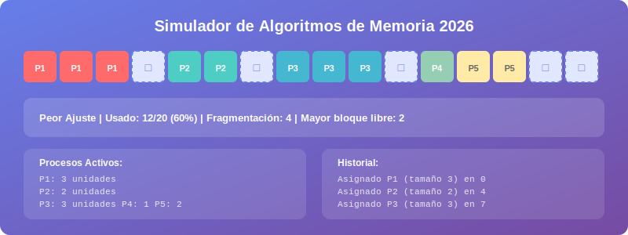

# Guía de Uso

Esta guía te explica cómo interactuar con el simulador paso a paso.



## Panel de controles

### Seleccionar algoritmo

Usa el menú desplegable **Algoritmo** para cambiar entre:

- **Peor Ajuste (Worst Fit)** — asigna al bloque más grande disponible
- **Mejor Ajuste (Best Fit)** — asigna al bloque más pequeño suficiente

!!! tip "Cambio en caliente"
    Puedes cambiar el algoritmo en cualquier momento, incluso con procesos activos.
    Las nuevas asignaciones usarán el algoritmo recién seleccionado.

### Agregar un proceso

1. Escribe el **tamaño** en el campo numérico (unidades de memoria)
2. Haz clic en **Agregar** o presiona `Enter`
3. El simulador asignará el proceso según el algoritmo activo
4. Si no hay espacio suficiente, aparecerá una alerta

!!! warning "Límite de memoria"
    Si el tamaño solicitado supera el mayor bloque libre disponible,
    la asignación fallará y se registrará en el historial.

### Liberar memoria

| Botón | Acción |
|-------|--------|
| **Liberar Aleatorio** | Libera un proceso al azar de los activos |
| **Limpiar Todo** | Reinicia la memoria completamente |

### Cambiar tamaño de memoria

1. Escribe el nuevo tamaño en el campo **Memoria**
2. Haz clic en **Aplicar Tamaño**
3. La memoria se reiniciará con el nuevo tamaño

!!! note "Tamaños recomendados"
    - Para demos rápidas: 20–50 unidades
    - Para explorar fragmentación: 100–200 unidades
    - Para carga alta: 500–1000 unidades

---

## Ejecutar una Demo

Las demos automatizan la inserción de varios procesos en secuencia para que
puedas observar el comportamiento del algoritmo sin intervención manual.

=== "Demo Pequeños"

    ```
    Secuencia: [2, 1, 3, 2, 1, 3, 2, 1, 2, 3]
    Uso: Ver cómo se llena la memoria con procesos chicos
    Ideal para: comparar fragmentación entre algoritmos
    ```

=== "Demo Grandes"

    ```
    Secuencia: [10, 8, 12, 9, 11]
    Uso: Observar asignación con procesos que consumen mucho espacio
    Ideal para: ver diferencia entre Worst y Best con pocos bloques
    ```

=== "Demo Mezclados"

    ```
    Secuencia: [8, 2, 6, 1, 10, 3, 4, 7, 2, 5]
    Uso: Escenario realista con variedad de tamaños
    Ideal para: el análisis más completo de ambos algoritmos
    ```

### Controlar la demo

- **Pausar Demo**: congela la ejecución en el paso actual
- **Reanudar Demo**: continúa desde donde se pausó
- El panel de estado muestra si la demo está *ejecutando* o *pausada*

---

## Leer la visualización

```
┌─────────────────────────────────────────┐
│  P1  P1  P1  □  □  P2  P2  □  □  □  P3 │
└─────────────────────────────────────────┘
      ↑              ↑           ↑
  Ocupado          Libre      Ocupado
```

- Celdas **de color** → ocupadas por un proceso (cada proceso tiene su propio color)
- Celdas **azul claro punteado** (□) → libres
- Pasa el cursor sobre cualquier celda para ver su posición exacta

## Leer las estadísticas

```
Peor Ajuste | Usado: 23/50 (46%) | Fragmentación: 4 | Mayor bloque: 12
```

| Campo | Significado |
|-------|-------------|
| **Usado** | Unidades ocupadas / total |
| **Fragmentación** | Cantidad de bloques libres separados |
| **Mayor bloque** | Tamaño del fragmento libre más grande disponible |

!!! tip "Usar la fragmentación como métrica"
    Un valor de fragmentación alto con un "Mayor bloque" pequeño indica que la memoria
    está muy fragmentada: hay mucho espacio libre pero inutilizable.
    Compara este valor entre Worst Fit y Best Fit con la misma demo.

---

Continúa con la [Referencia Técnica](referencia.md) para detalles de implementación.
